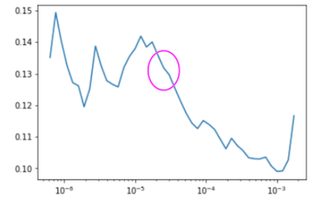
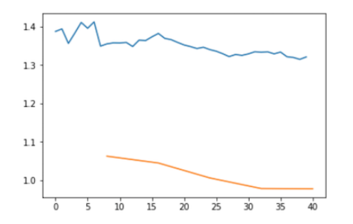

# Lesson 2

## Choosing a good learning rate

Without getting into the math, choosing a good learning rate is usually about finding the strongest downward slope.



You can see this plot by calling

```Python
learn.lr_find()
learn.recorder.plot()
```

## Cleaning up your image set

Another thing you may want to do with the data is clean it up. For example if its not an academic data set and is something you downloaded off google there may be misidentified images there. To see what samples produced the most confusion you can use `top_losses`.

```Python
from fastai.widgets import *

losses,idxs = interp.top_losses()
top_loss_paths = data.valid_ds.x[idxs]
```

There is also a nifty tool that was created in fast.ai to help easily clean up these bad images called the FileDeleter.

```Python
fd = FileDeleter(file_paths=top_loss_paths)
```

## Things that can go wrong

If you are getting bad results and you have a good amount of data, there is usually two culprits.

1. Your learning rate is too high or low
2. You number of epochs is too high or low

### Learning Rate too high

Usually this manifests itself as a very high validation loss. If you notice a very high validation loss, like for example.

```txt
Total time: 00:13
epoch  train_loss  valid_loss  error_rate
1      12.220007   1144188288.000000  0.765957    (00:13)
```

It means your lr is too high, if this happens you can't fix the model, you must retrain it.

### Learning Rate too low

This means your model will converge very slowly, but will converge. This can show up as a training loss > validation loss. If this happens it means you have under fitted and need either more epochs or a higher learning rate.

```txt
Total time: 01:07
epoch  train_loss  valid_loss  error_rate
1      1.349151    1.062807    0.609929    (00:13)
2      1.373262    1.045115    0.546099    (00:13)
3      1.346169    1.006288    0.468085    (00:13)
4      1.334486    0.978713    0.453901    (00:13)
5      1.320978    0.978108    0.446809    (00:13)
```

```python
learn.fit_one_cycle(5, max_lr=1e-5)
learn.recorder.plot_losses()
```



As you can see the error is dropping very slowly.

### Too few epochs

This can happen if you simply did not give you model enough time to train. If you tried tuning the learning rate and still have no luck maybe try a few more epochs to see if you can get the error to go down.

### Too many epochs

Over fitting a model means your model becomes very good at recognizing your training set and nothing else, this can happen if it is trained too long on this set, it perfectly fits the data and does not generalize well to other data. In practice this is very hard to do, however you can recognize it by a decrease in error for a while, then an increase in error, making a "V" shaped graph.

## What's happening under the hood

If you want a really good understanding watch the 3Blue1Brown series [here](https://www.youtube.com/watch?v=aircAruvnKk).

You can think of making a prediction as a function of pixel values which returns a probability distribution. For example.

```txt
f(my_image) =  0.99=dog,
               0.01=cat
```

The simplest and most often used way to get a prediction at the end just to make the largest probability value and say thats our prediction. You can often see this in python code as `np.argmax`.

To make a model learn the math that goes on is referred to as stochastic gradient descent. This is a technique used to find the minium of a function with many inputs. The model makes a prediction and we look at the outputs, to calculate the error we take the root mean square error of the guess vs the actual answer and that gives us a measurement of how good the model if performing. Eventually the model can be tunned until it fits our data and we can make accurate predictions.

### Vocabulary

- Learning rate: A thing we multiply our gradient by to decide how much to update the weights by.

- Epoch: One complete run through all of our data points (e.g. all of our images). So for non-stochastic gradient descent we just did, every single loop, we did the entire dataset. But if you've got a dataset with a thousand images and our mini-batch size is 100, then it would take you 10 iterations to see every image once. So that would be one epoch. Epochs are important because if you do lots of epochs, then you are looking at your images lots of times, so every time you see an image, there's a bigger chance of overfitting. So we generally don't want to do too many epochs.

- Mini-batch: A random bunch of points that you use to update your weights.

- SGD: Stochastic gradient descent using mini-batches.

- Model / Architecture: They kind of mean the same thing. In this case, our architecture is [\vec{y} = X\vec{a}] ﹣ the architecture is the mathematical function that you're fitting the parameters to. And we're going to learn later today or next week what the mathematical function of things like ResNet34 actually is. But it's basically pretty much what you've just seen. It's a bunch of matrix products.

- Parameters / Coefficients / Weights: Numbers that you are updating.

- Loss function: The thing that's telling you how far away or how close you are to the correct answer. For classification problems, we use cross entropy loss, also known as negative log likelihood loss. This penalizes incorrect confident predictions, and correct unconfident predictions. The validation loss is the calculated error against the validation set and training loss is the calculated error against the training set.
