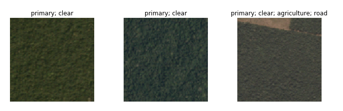
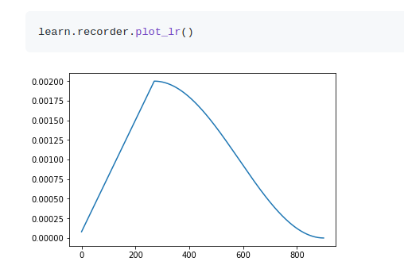
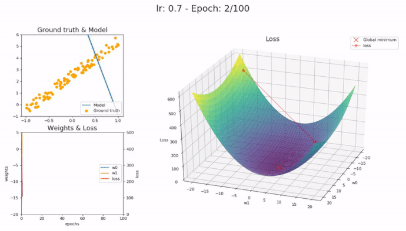

# Lesson 3

## Multi-label classification

Multi-label classification is the activity of assigning multiple labels to an image. So for example rather than saying something is a 3. You might label it as hand-drawn, pen, 3. In turns out that this kind of image classification can be done in a very similar way.



First lets download the satellite data.

```Python
path = Config.data_path()/'planet'
path.mkdir(exist_ok=True)
```

```Bash
7za -bd -y -so x {path}/train-jpg.tar.7z | tar xf - -C {path}
```

The data happens in this case to be stored in a csv file in this form.

```csv
0 	train_0 	haze primary
1 	train_1 	agriculture clear primary water
2 	train_2 	clear primary
3 	train_3 	clear primary
4 	train_4 	agriculture clear habitation primary road
```

We can use the data bunch class to turn this into something the model can digest. There are many consideration to make.

- Where do the files live
- What's the structure they're in
- How do the labels appear
- How do you spit out the validation set
- How do you transform it

Fast.ai has a library which attempts to make this easy, the data block API.

As an example using our satellite data set.

```Python
# satellite images could be flipped or zoomed in, set the possible transformations
tfms = get_transforms(flip_vert=True, max_lighting=0.1, max_zoom=1.05, max_warp=0.)

# create a validation set with 0.2 = 20% of the data, set sep=' ' so we use each label
np.random.seed(42)
src = (ImageList.from_folder(path)
       .label_from_csv('train_v2.csv',sep=' ',folder='train-jpg',suffix='.jpg')
       .random_split_by_pct(0.2))

# finally create the data bunch using our transform and src objects, which we will then normalize using these statistics (imagenet_stats)
data = (src.datasets()
        .transform(tfms, size=128)
        .databunch().normalize(imagenet_stats))
```

Now we have the dataset, this needs to be transformed into a data loader, that is something that the gpu can use to train.

A few interesting points about this.

- Transforms: Transforms by default will flip randomly each image, but they'll actually randomly only flip them horizontally. If you're trying to tell if something is a cat or a dog, it doesn't matter whether it's pointing left or right. But you wouldn't expect it to be upside down. On the other hand for satellite imagery whether something's cloudy or hazy or whether there's a road there or not, could absolutely be flipped upside down. There's no such thing as a right way up from space. So flip_vert which defaults to False, we're going to flip over to True to say you should actually do that. And it doesn't just flip it vertically, it actually tries each possible 90-degree rotation (i.e. there are 8 possible symmetries that it tries out).
- Warp: Basically, the reason this is interesting is if I look at you from below versus above, your shape changes. So when you're taking a photo of a cat or a dog, sometimes you'll be higher, sometimes you'll be lower, then that kind of change of shape is certainly something that you would want to include as you're creating your training batches. You want to modify it a little bit each time. Not true for satellite images. A satellite always points straight down at the planet. So if you added perspective warping, you would be making changes that aren't going to be there in real life. So I turn that off.

## Creating multi-label classifier

First we set the architecture to resnet50, which works better in this case, but of course takes longer to run.

```Python
arch = models.resnet50

# define our metrics to measure how good our model is
acc_02 = partial(accuracy_thresh, thresh=0.2)
f_score = partial(fbeta, thresh=0.2)

# create the learner
learn = create_cnn(data, arch, metrics=[acc_02, f_score])

#train
lr = 0.01
learn.fit_one_cycle(5, slice(lr))
```

### What is thresh

Unlike the cat/dog example say, where our prediction was whatever the highest probability was, this dataset has multiple labels. This means we can't just take the highest or our data would only ever have one label. To deal with this we set a threshold. That is if our probability P > thresh, we say the picture has that attribute.

## What is happening to the learning rate



Here you can see the lr increases to a maximum, then slowly decreases. When you pass in a learning rate to your model what you are actually setting is the maximum learning rate. The idea behind doing this with the lr is, as we approach a minimum, we want to start to narrow in on a good spot to rest. This technique is called **learning rate annealing**.



So then why increase at the beginning? Unlike the picture surface above loss functions tend to have a "bumpy" surface, ie a lot of local minimums. By increasing first you reduce the change you get caught in one of these local minimums, this make the model generalize better.

## How does a model fit

A neural network is basically a bunch a matrix multiplications. But matrix multiplication is a linear operation, so how do you fit arbitrary surfaces? The answer is you combine it with something called a **ReLU** (rectified linear unit) = max(x, 0). There is a nice theorem called the **universal approximation theorem** which states that matrix multiplication combined with this ReLU can fit arbitrary surfaces and so we can create non-linear models, combine that with gradient descent to actually find the values to fit your data and you have a neural network.
