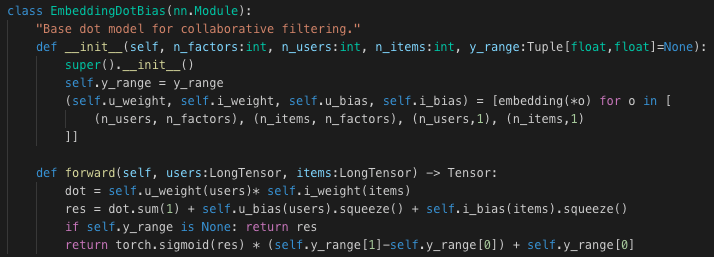

# Lesson 4

## Natural Language Processing (NLP)

NLP is the ability to do automated language classification, this has applications in areas like spam prevention and diagnosing medical reports. Language classification has been a historically difficult problem for machine learning. Essentially for an application in say, sentiment analysis, you have to teach your model to speak English. Since this can take a long time a popular approach is to use transfer learning.

### NLP Transfer Learning

Let's take our example of classifying movie reviews as positive or negative. In a sense the "hard part" here is not classifying the reviews, its learning English. Luckily there exists a pre trained model called the **Wikitext 103** dataset which exists to do just that. The model was trained to do word prediction, that is given this sentence fragment, what would the next word in the sentence be.

### Fine-tuning Wikitext to create a new language model

If we can train a model that's good at predicting the next word of movie reviews pre-trained with the Wikitext model, then that's going to understand a lot about how movie reviews are written. What this means is we can train our model on movie reviews without actually labeling them as positive or negative. It will just learn to predict that next word. Then once we have this movie review base we can use transfer learning to then make a model that can do the movie review sentiment analysis.

This approach was is called **self supervised learning**. We have a model that can understand movie reviews in general, then we can fine tune that to do whatever we want. In this case classifying them as positive or negative.

## The Basic Process

Now lets set up the model.

First get our data

```Python
path = untar_data(URLs.IMDB_SAMPLE)
path.ls()
```

Next lets turn our data into a pandas data frame

```Python
df = pd.read_csv(path/'texts.csv')
df.head()
```

```text
 	label 	    text 	                                            is_valid
0 	negative 	Un-bleeping-believable! Meg Ryan doesn't even ... 	False
1 	positive 	This is a extremely well-made film. The acting... 	False
2 	negative 	Every once in a long while a movie will come a... 	False
3 	positive 	Name just says it all. I watched this movie wi... 	False
4 	negative 	This movie succeeds at being one of the most u... 	False
```

So you can just go TextDataBunch.from_csv to grab a language model specific data bunch:

```Python
data_lm = TextDataBunch.from_csv(path, 'texts.csv')
```

And then you can create a learner from that in the usual way and fit it.

```Python
data_lm.save()
```

You can save the data bunch which means that the pre-processing that is done, you don't have to do it again. You can just load it.

```Python
data = TextDataBunch.load(path)
```

## Language Model

We're going to start with the language model. Now the good news is, we don't have to train the Wikitext 103 language model. So we're gonna start fine-tuning our IMDB language model.

```Python
bs=48

data_lm = (TextList.from_folder(path)
           #Inputs: all the text files in path
            .filter_by_folder(include=['train', 'test']) 
           #We may have other temp folders that contain text files so we only keep what's in train and test
            .random_split_by_pct(0.1)
           #We randomly split and keep 10% (10,000 reviews) for validation
            .label_for_lm()
           #We want to do a language model so we label accordingly
            .databunch(bs=bs))
data_lm.save('tmp_lm.pkl')
```

We can say:

- It's a list of text files﹣the full IMDB actually is not in a CSV. Each document is a separate text file.
- Say where it is﹣in this case we have to make sure we just to include the train and test folders.
- We randomly split it by 0.1.

## Training

At this point we have our data loaded into a format fast.ai can work with and we are ready to start training. As usual we pass in two things.

- The data: our language model data
- What pre-trained model we want to use: here, the pre-trained model is the Wikitext 103 model that will be downloaded from fastai similarly to the pre-trained ImageNet data set.

```Python
learn = language_model_learner(data_lm, pretrained_model=URLs.WT103, drop_mult=0.3)
```

Behind the scenes this is not going to create a cnn but rather an rnn (recurrent neural network). Same basic structure with some subtle differences that will be discussed later.

So now we have a model. We can again do `lr_find()` to check our learning rates and we will go through the familiar steps of choosing the strongest slope and calling `fit_one_cycle` to try and fine tune the model.

With a pretty good GPU this can take two or three hours, NLP is generally a difficult thing to train a model to do.

Now we have our model trained with IMDB data which can predict movie review text.

```Python
learn.predict('I liked this movie because ', 100, temperature=1.1, min_p=0.001)
```

Here we get something that seems vaguely English like. This means were on the right track.

## Classifier

Now we have our general movie predictor rnn. We can now train it to do our original task, movie sentiment analysis.

```Python
data_clas = (TextList.from_folder(path, vocab=data_lm.vocab)
             #grab all the text files in path
             .split_by_folder(valid='test')
             #split by train and valid folder (that only keeps 'train' and 'test' so no need to filter)
             .label_from_folder(classes=['neg', 'pos'])
             #remove docs with labels not in above list (i.e. 'unsup')
             .filter_missing_y()
             #label them all with their folders
             .databunch(bs=50))
data_clas.save('tmp_clas')
```

We want to make sure that is uses exactly the same vocab that are used for the language model otherwise it would be like the two models are speaking different languages.

We can view that data bunch as follows.

```Python
data_clas = TextClasDataBunch.load(path, 'tmp_clas', bs=bs)
data_clas.show_batch()
```

And once again we go through the process of learning, plotting, finding a good learning rate and retraining until we get a decent accuracy.

## Tabular

Tabular data is any type of data that appears in the form of a table. This includes spreadsheets, a relational database or a financial report. In the past it was a widely held belief that machine learning was not suitable for analyzing tabular data. It was believed that techniques such as random forests, logistic regression or gradient boosting should be used. To do this we can use `fastai.tabular`.

First the required imports.

```Python
from fastai import *
from fastai.tabular import *
```

The standard format for tabular data in python is a pandas data frame. In this example we will be using a table of data collected from different people about features such as education and marital status.

```Python
path = untar_data(URLs.ADULT_SAMPLE)
df = pd.read_csv(path/'adult.csv')
```

Next declare our variables

```Python
dep_var = 'salary'
cat_names = ['workclass', 'education', 'marital-status', 'occupation', 'relationship', 'race']
cont_names = ['age', 'fnlwgt', 'education-num']
procs = [FillMissing, Categorify, Normalize]
```

```Python
test = TabularList.from_df(df.iloc[800:1000].copy(), path=path, cat_names=cat_names, cont_names=cont_names)

data = (TabularList.from_df(df, path=path, cat_names=cat_names, cont_names=cont_names, procs=procs)
                           .split_by_idx(list(range(800,1000)))
                           .label_from_df(cols=dep_var)
                           .add_test(test, label=0)
                           .databunch())
```

### Continuos vs Categorical

Your independent variables are those which you are using to make predictions with. These variables can be either discrete or continuous. Any time you can select a result for a finite set, these are called categorical variables, so for example marital status or level of education would be categorical. To model categorical variables in our model we need to use a special technique called **embeddings**. Continuos variables can be passed into the neural net just like any other from of data. In short this is why we need to separate the categorical from the continuos variables when setting up the model.

### Processor

Next we passed in something that looks a lot like transforms in computer vision. Transforms in computer vision performed operations like flipping or warping. In tabular data we have these processors. The key difference between the two is the processes happen prior to training rather than during.

The ones we passed in above, and will usually use are;

- *FillMissing*: Look for missing values and deal with them some way.
- *Categorify*: Find categorical variables and turn them into Pandas categories
- *Normalize* : Do a normalization ahead of time which is to take continuous variables and subtract their mean and divide by their standard deviation so they are zero-one variables.

For all these processors, whatever we do in the training set must also be done in the validation set.

Now we need to split the data, for tabular data we usually want to maintain the contiguity of the data. So map tiles or time periods should occur next to each other. To do this we use `split_by_idx`.

So now that we split the data we are ready to label it, in this case the labels come directly from the data and we identify the dependent variable which is whether this person makes over $50, 000.

```Python
learn = tabular_learner(data, layers=[200,100], metrics=accuracy)
learn.fit(1, 1e-2)
```

## Collaborative Filtering

Collaborative filtering is where you have information about how bought what or who liked what. We will be working with a movie dataset where we have a matrix of people and movies and an entry indicating either they liked that movie, didn't like the movie or have not seen the movie.

```Python
from fastai import *
from fastai.collab import *
from fastai.tabular import *

user, item, title = 'userId','movieId','title'

path = untar_data(URLs.ML_SAMPLE)

ratings = pd.read_csv(path/'ratings.csv')
ratings.head()
```

```txt
 	userId 	movieId rating 	timestamp
0 	73 	    1097 	4.0 	1255504951
1 	561 	924 	3.5 	1172695223
2 	157 	260 	3.5 	1291598691
3 	358 	1210 	5.0 	957481884
4 	130 	316 	2.0 	1138999234
```

So now that we've got a data frame, the nice thing about collaborative filtering is it's incredibly simple.

```Python
data = CollabDataBunch.from_df(ratings, seed=42)
y_range = [0,5.5]
learn = collab_learner(data, n_factors=50, y_range=y_range)
learn.fit_one_cycle(3, 5e-3)
```

*This is the halfway point of the course, here we have seen all the key application of machine learning. Now from this point onward the course will focus more on digging into the details of how these types of things work*

## What is an Embedding

An embedding, not surprisingly, is a matrix of weights. It's a weight matrix that is intended to be indexed into and you grab one vector from. So in the movie example you have an embedding matrix for movies, en embedding matrix for users and the values for the weight matrix is the dot product of those two matrices.

But this is not enough information, for example there may be some users who just hate every movie they see or some movies which everyone seems to like. To deal with this we add bias terms.



Finally after taking the dot product and adding the bias, we need to normalize the data, in this our movies reviews are between 0 and 5, so we want to normalize along that range. To accomplish this we will use the sigmoid function.

```Python
return torch.sigmoid(res) * (self.y_range[1]-self.y_range[0]) + self.y_range[0]
```

And thats it, machine learning is just matrix multiplications and non linearity's done in a clever way.

## Overview of Important Terminology

In the next three lessons we will be building on top of what this simple collaborative filtering example to build the more complicated networks we have seen. Roughly speaking these are the many topics which we will learn about.

```txt
    Inputs
    Weights/parameters
        Random
    Activations
    Activation functions / nonlinearities
    Output
    Loss
    Metric
    Cross-entropy
    Softmax
    Fine tuning
        Layer deletion and random weights
        Freezing & unfreezing
```
