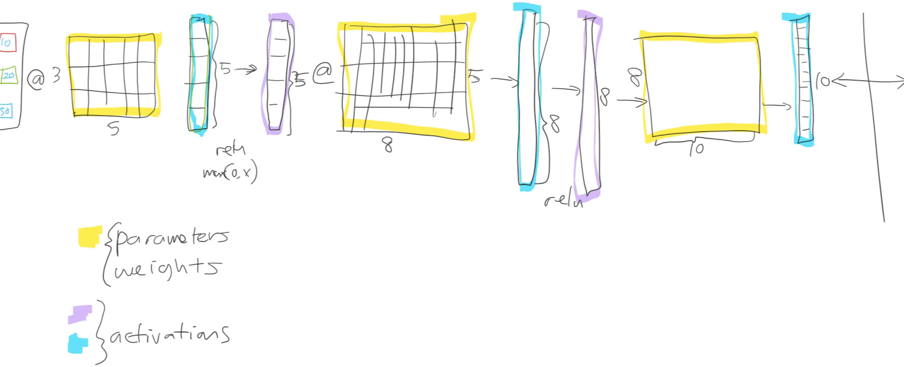
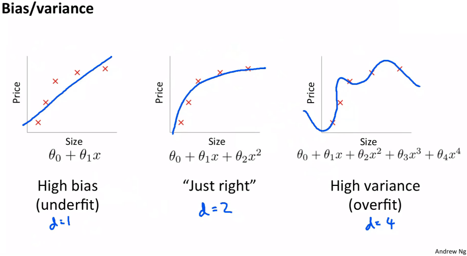
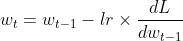
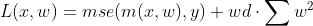

# Lesson 5

## What Does A Neural Net Look Like

Our network contains two types of layers, a parameter matrix and activations. The weights in the parameters matrix is what you learn, that is its what we tweak over time using gradient descent. The activations is what we use to add non-linearity, so taking the first layer as an example we perform a matrix multiplication between our input and the activation vector then we apply a non linear function, in this case the RELU, and repeat that for however many layers we have.

Thanks to a theorem called "The Universal Approximation Theorem" if we have enough parameters we can approximate any function arbitrarily closely, for example a function that may be able to determine if something is a cat or dog given an input vector of RGB values.

Now we do all these matrix multiplies and we get a guess, which on the first go is likely wrong. We calculate the error then using a technique called **back propagation** i.e. `weights ﹣= weight.grad * learning rate` to tweak these parameters. Repeating this processes by continually trying to minimize error gets us to something that can start to recognize pictures, or sentiments or whatever else we want.

## Fine Tuning & Transfer Learning

So what happens when we want to do some transfer learning? First thing is we pick a starting architecture, say ResNet34. Next we throw away the last layer, this is because the last layer is a very specialized layer, it has as many columns as there are categories of things to predict, its likely your prediction categories do not match up to what ResNet originally was trained to recognize (if it is, why bother retraining at all). Then we replace that layer with a randomized weight matrix with as many columns as we have categories, then we train. The idea is we can use these other pre trained layers and converge on recognizing whatever we want to recognize much faster.

### Freezing Layers

When transfer learning we usually don't want to touch the layers that have already been trained in the original model, these layers are already highly customized and retraining them would defeat part of the purpose of using transfer learning, so then we "freeze" these layers. Essentially what this means is back propagation will not adjust the weights of the frozen layers.

### Unfreezing and Using Discriminative Learning Rates

After a while, when we feel we have trained the network we may want to unfreeze the network to allow for fine tuning.

**Discriminative learning rates** referees to using a different learning rate at different parts of the model. By default (at least with a CNN), you'll get three layer groups. If you say slice(1e-5, 1e-3), you will get 1e-5 learning rate for the first layer group, 1e-4 for the second, 1e-3 for the third.

### Affine Function

Affine functions is a more general term for a linear function. So, for example a matrix multiplication is a type of affine function. Technically a machine learning algorithm can use any affine function but its most often easier to just think in terms of matrix multiplication.

## Bias

In a collaborative filtering model for example, its helpful to add something called a bias to the data. Take for example movies and people's ratings. It's possible to have a movie that everyone likes or have a user who rates every movie very poorly, this would contribute to a bias. So for example taking our user who rates every movie poorly we may add a positive bias to their score.

## Regularization: Weight Decay

What we want to do is avoid over-fitting our data. To do this is to ensure our function is not "too complex", one way to do this is the limit the number of parameters, but this does not generalize well because sometimes we do need those parameters, another way is to make the value of those parameters very small i.e. close to zero, for parameters we wish not to have an effect on the function.

To accomplish this we can use weight decay, you take the sum of the squares of the thetas, this gives an approximate measure of function complexity, then we multiply this sum by some parameter we choose, this parameters is called weight decay, or `wd` in fast.ai. The weight_decay value determines how dominant this regularization term will be in the gradient computation.

## So What Is SGD

So what will our weights be at epoch *t*? Well we take what the weights are at epoch *t - 1*. Then we subtract off the derivative of our loss with respect to wt - 1 and we temper how much of an effect this will have on our new weights but multiplying by our learning rate hyper parameter.

So what is L? L is our loss function and is defined as.

We take the mean squared error (mse) of our prediction, then we also add on the weight decay, which as mentioned before is just the sum of squares of the weight multiplied by the wd hyper parameter.
