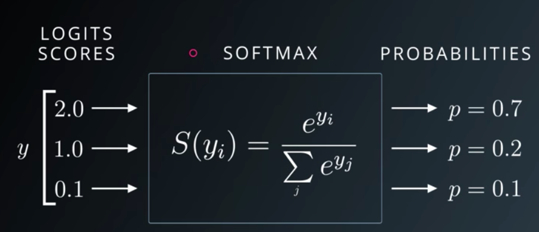
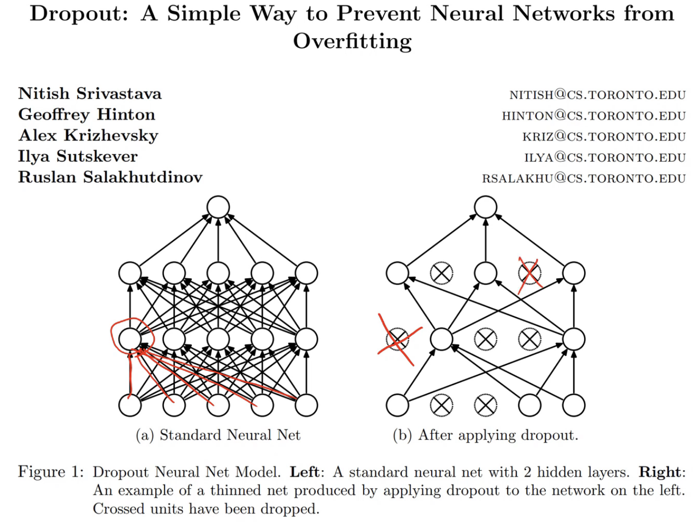
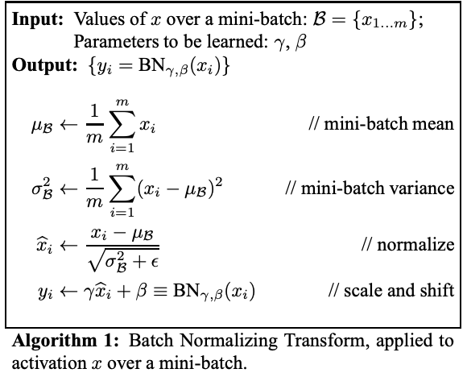

# Lesson 6

## Tabular Models

Our specific tabular problem, which is a a classification problem is a problem with both continuous and categorical variables where we try to predict who will make over $50,000.

```Python
from fastai.tabular import * # import the tabular data code

dep_var = '>=50k' # what we are trying to predict
cat_names = ['workclass', 'education', 'marital-status', 'occupation', 'relationship', 'race'] # categorical variables 
cont_names = ['age', 'fnlwgt', 'education-num'] # continuous variables
procs = [FillMissing, Categorify, Normalize] # pre processing
```

The loss function for categorical variables is a bit different. We can't use MSE because with a categorical variable how close the categories are has no meaning. For example considering the  hand written digit problem. If the number is a 1 guessing 0 is just as wrong as guessing 7. To capture this idea we use a loss function called **Cross Entropy Loss**. To calculate cross entropy loss all you need to do is calculate the log of your guess for the correct answer. So if you for example guessed between cat and dog and guessed cat with P = 0.7 and it was a cat the loss would be log(0.7).

Now this loss function only works under the following conditions.

- All of the activations add up to 1
- All of the activations are greater than 0
- All of the activations are less than 1

To accomplish this we apply the **soft max** activation function to the guess vector.



Fast.ai in most cases will be smart enough that, once you specify cross entropy loss as your function, to use softmax as the activation.

### Tabular Regularization & Transforms

Recall regularization is a technique used to avoid over fitting.

Transforms are a type of pre processing that runs every time you grab data from a data set. They run once on the training set and then any kind of state or metadata that's created is then shared with the validation and test set.

### Categorify

The first pre processor is categorify. What this does is will analyze a column, and if it sees that a column is made up of discrete categories, it will assign an integer to each of those categories and replace what was originally in the column with an integer. You of course must ensure the same happens to your test set, you can do this by passing `test=true` into the test set.

### Fill Missing

This will create, for anything that has a missing value an extra column is created which is set to True if the data is provided and False if it is not. We do this because very often the fact that this particular piece of data is missing is interesting and will help us make better predictions.

### Categorical and Continuous Variables

The main thing you have to do if you want to create a data bunch of tabular data is tell it what are your categorical variables and what are your continuous variables. You've got to think carefully about what variable should be what, if the cardinality of a class isn't too high you should considering making it a category, for example days of the month would be a good candidate for a category even though it is technically continuos.

## Dropout

Dropout is a kind of regularization.



At random, we throw away some percentage of the activations not the weights, not the parameters. When we throw away an activation, we throw it away with probability p. Usually p = 0.5.

Then the next question is, why would we want to do this? The idea behind it is using this technique makes it some no 1 activation can memoize some part of the input. If we over fit that means some part of the model has memorized a specific input. With dropout its going to be very hard for the model to do that. In Fast.ai you can specify dropout be providing a parameter called `ps`.

```Python
learn = tabular_learner(data, layers=[1000,500], ps=[0.001,0.01], emb_drop=0.04,
                        y_range=y_range, metrics=exp_rmspe)
```

## Batch Normalization



The algorithm is going to take a mini batch. Remember this is a layer, so the thing coming into it is activations. Batch norm is a layer, and it's going to take in some activations. So the activations are what it's calling [x1, x2, x3] and so forth.

1. The first thing we do is we find the mean of those activations.
2. The second thing we do is we find the variance of those activations - a difference squared divided by the mean is the variance.
3. Then we normalize - the values minus the mean divided by the standard deviation is the normalized version. It turns out that bit is actually not that important but we used to think it was.
4. We take those values and we add a vector of biases (they call it beta here). So we're just going to add a bias term as per usual. Then we're going to use another thing that's a lot like a bias term, but rather than adding it, we're going to multiply by it. So there's these parameters gamma γ and beta β which are learnable parameters.

The details are not too important but it turns out doing this drastically lowers training time.
